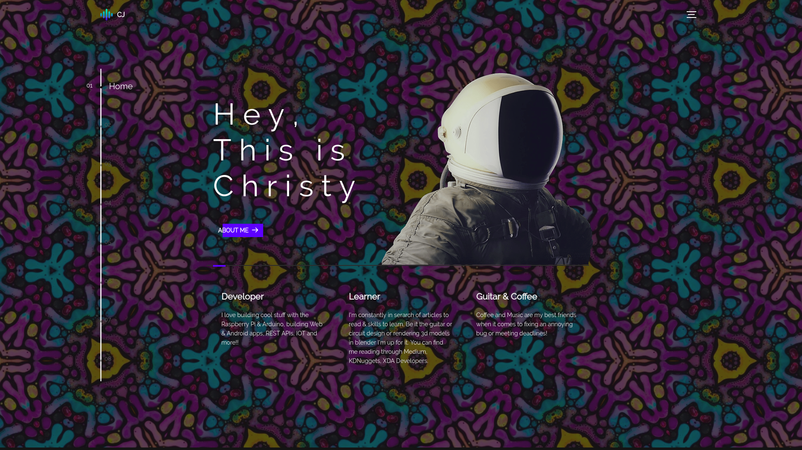
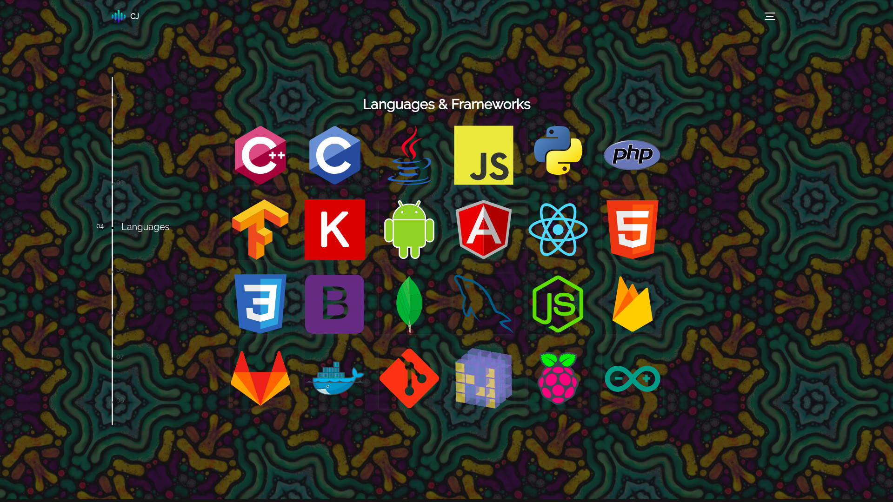
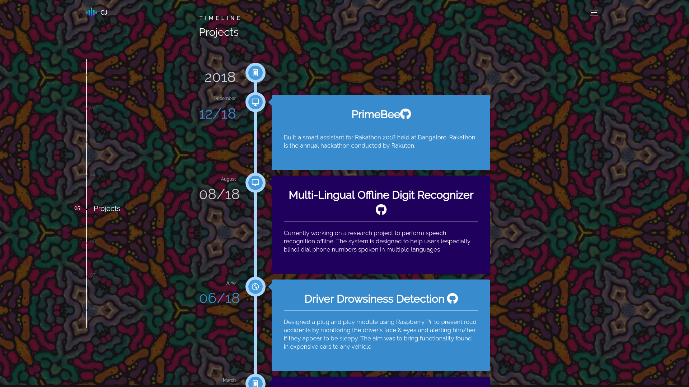

<h1 align="center">Portfolio 101 👋</h1>
<p align = center>
    
</p>
<p align="center">
  
  

  
  
  <a href="https://github.com/christyjacob4/christyjacob4.github.io/blob/master/LICENSE">
    
  </a>

  <a href="https://twitter.com/christyjacob4">
    
  </a>
</p>
<h3 align="center">Version 1.0 of my personal website built using HTML5, CSS and JQuery </h3>


## 🚀 Usage

Just run the following command at the root of your project to install dependencies:

```sh
npm install 
```

Start a local server at `http://localhost:3000` using : 

```sh
npm start
```


## ✨ Screenshots

<p align="center">
  
</p>
<p align="center">
  
</p>
<p align="center">
  
</p>
<p align="center">
  
</p>

## 🍻 Contributing

Contributions, issues and feature requests are welcome.<br />
Feel free to check [issues page](https://github.com/christyjacob4/christyjacob4.github.io/issues) if you want to contribute.

## 🤝 Acknowledgements
- Icons by [Flaticon](https://www.flaticon.com/)
- Global theme by [@buckymaler](https://github.com/BuckyMaler/global)

## 👤 Author

**Christy Jacob**

- Twitter: [@christyjacob4](https://twitter.com/christyjacob4)
- Github: [@christyjacob4](https://github.com/christyjacob4)

## 😵 Issues
- The website is not responsive.

## 🙌 Show your support

Please ⭐️ this repository if this project helped you!

## 📝 License

Copyright © 2019 [Christy Jacob](https://github.com/christyjacob4).<br />
This project is [MIT](https://github.com/christyjacob4/christyjacob4.github.io/blob/master/LICENSE) licensed.

---
